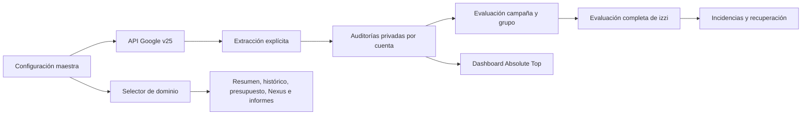

# Dominios Google y Absolute Top Monitoring

Entrega del 2 de octubre de 2026 UTC en `codex/dominios-absolute-top`, desde `f32ba707`.
La [entrega vigente para la fase final](ENTREGA_CLAUDE_FASE_FINAL.md) añade el orden de
auditoría y aceptación. Este informe describe la funcionalidad nueva; la [entrega anterior](ENTREGA_CLAUDE_V1.md)
conserva la evidencia histórica de las seis plataformas y los pendientes de producción.
La aceptación de esta funcionalidad es para **izzi**. Sky conserva su acceso y sus datos.

## A. Implementación y arquitectura

La API entrega metadatos de dominio y observaciones de Google; el monitoreo guarda auditorías
privadas, evalúa campañas y grupos de manera independiente y proyecta las vistas por dominio.



Archivos principales:

- API: `src/config/google-ads-domains.json`, `src/config/google-domains.ts`,
  `src/routes/google-domains.ts`, `src/providers/google/absolute-top.ts`,
  `src/types/google-absolute-top.ts`, `src/routes/data.ts`.
- Monitoreo: `src/lib/domains/`, `src/lib/data/domain-source.ts`,
  `src/lib/absolute-top/`, `src/app/(app)/absolute-top/page.tsx`,
  `src/app/api/absolute-top/route.ts`, `src/components/absolute-top/`.
- Integración: `src/lib/unified/{schema,store,source,sync}.ts`,
  `src/lib/services/{context,snapshot,evaluate}.ts` y reconciliación de incidencias.

## B. Clasificación única de dominios

La **única asignación de cuentas y objetivos** se guarda en
[`google-ads-domains.json`](../../unified-ads-api/src/config/google-ads-domains.json).
El monitoreo valida y conserva una copia del contrato obtenido por
`GET /api/v1/google-domains`; no mantiene otro mapa por nombres ni por IDs.

| Dominio | Customer ID | Nombre maestro | Mínimo |
|---|---|---|---|
| Primer Dominio | 8779536058 | izzi – Performance AO - mxn | 70% |
| Primer Dominio | 6214109105 | izzi – Performance AO - mxn 2 | 70% |
| Segundo Dominio | 3224850043 | izzi - Paquetes - 2do Dominio | 10% |
| Tercer Dominio | 7367928294 | izzi - Ofertas | 25% |

Los IDs son cadenas: `877-953-6058` y `8779536058` identifican la misma cuenta.
No se asigna un dominio por parecido del nombre. Una cuenta desconocida conserva
`unclassified`/«Sin clasificar», sin objetivo supuesto, y una advertencia técnica.
Los metadatos son `domain_id`, `domain_name`, `customer_id` y `account_name`.

La configuración también centraliza volumen mínimo de 100 impresiones, banda preventiva
de 5 pp, caída súbita de 7 pp, deterioro adicional de 5 pp, intervalo de recordatorio de
6 horas y retención de 90 días. Son valores configurables de esta primera implementación.
Añadir otro dominio se hace en el maestro; el selector y las validaciones admiten nuevas
entradas sin copiar una tabla dentro de cada pantalla.

## C. Google Ads API

El campo equivalente a **Impr. (Abs. Top) %** es
`metrics.absolute_top_impression_percentage`, recibido como razón entre 0 y 1.
**No** equivale a `metrics.search_absolute_top_impression_share`, cuya base son
impresiones elegibles estimadas.

El [contrato Google v25](../../unified-ads-api/docs/GOOGLE_ABSOLUTE_TOP.md) documenta
fuentes oficiales, GAQL de catálogos y métricas, selecciones por nivel y límites.
El endpoint `GET /api/v1/google/absolute-top` exige cuenta, v25, rango de hasta siete días
y granularidad diaria u horaria. Consulta catálogos activos Search y une sus métricas;
las entidades sin reporte siguen apareciendo con N/D. Una cuenta MCC, una ventana inválida
o una extracción que excede la capacidad devuelven error explícito.
El consumidor del monitoreo limita además cada respuesta a 25 MiB y 100.000 filas por cuenta.
Una extracción que supera ese límite se registra como no disponible, sin truncarla ni confirmar
recuperaciones; acota el período si el volumen horario de la cuenta excede la capacidad.

El contexto incluye tasa Top de página, Search IS, pérdida por ranking y presupuesto,
impresiones, clics, CTR, CPC, gasto, conversiones de plataforma, estrategia de puja,
presupuesto de campaña, moneda, reloj de origen y extracción.
La pérdida por presupuesto **no está disponible por grupo**: se mantiene N/D y no se
hereda el valor de campaña. Los valores censurados de cuota (`<10%`, `>90%`) mantienen
su límite sin convertirse en valores exactos. Cero explícito y campo ausente se distinguen.

Las consultas de presencia excluyen Search Partners. Las cuotas pueden madurar durante
uno o dos días; una lectura inmediata no acredita conciliación con Ads Manager.

## D. Evaluación de campañas

Cada campaña activa Search se evalúa con el mínimo de su dominio:

| Estado | Condición |
|---|---|
| Cumple | tasa ≥ mínimo |
| Cerca del límite | tasa < mínimo y brecha de hasta 5 pp |
| Fuera del objetivo | brecha mayor de 5 pp |
| Datos insuficientes | tasa ausente, cobertura incompleta o volumen menor al mínimo |
| Sin clasificar | cuenta sin asignación maestra |

La brecha es `100 × (tasa − mínimo)`, en **puntos porcentuales**. Con 62% y mínimo
70% la brecha es −8 pp. Se protegen los límites contra errores de coma flotante.
El análisis no convierte una tasa ausente en cero ni decide eventos principales de negocio.
Las conversiones del módulo se rotulan **conversiones de plataforma**.

## E. Evaluación independiente de grupos

Los grupos activos se evalúan con sus propias observaciones y el mínimo del dominio.
Una campaña al 73% puede cumplir mientras un grupo al 45% genera afectación localizada.
La clasificación cruzada distingue contexto sano, afectación localizada, generalizada,
concentrada o no evaluable. El peso del grupo se obtiene de
`impresiones del grupo / impresiones de su campaña`; un padre ausente o un denominador
inconsistente no produce un peso inventado.

La jerarquía navegable es **Dominio → Cuenta → Campaña → Grupo de anuncios**.
La pérdida de cuota por ranking o presupuesto aporta posibles explicaciones, sin declarar
causalidad ni recomendar aumentos automáticos de presupuesto.

## F. Histórico y comparaciones

Se guardan auditorías identificadas por `auditId`, cuenta, ventana, granularidad, reloj,
fecha de extracción, cobertura y observaciones. Cada cuenta tiene un documento atómico
en el `RecordStore` privado. La historia y sus contadores se actualizan juntos; un replay
idéntico no avanza persistencia y un ID reutilizado con otro contenido se rechaza.

Se conserva evolución, primera y última detección, auditorías válidas consecutivas,
horas observadas desde la detección, mínimo, máximo y promedio de tasas observadas.
Ese tiempo transcurrido no demuestra que el problema haya sido continuo durante huecos
de datos. Las páginas consultan historia guardada; no cuentan como una extracción nueva.

Las comparaciones incluyen auditoría anterior comparable, día anterior al mismo corte,
24 horas y siete días. Se separan diario/horario, moneda y reloj, y se sustituyen refrescos
del mismo período en vez de sumarlos como tráfico adicional. Una ventana incompleta
no se presenta como comparación completa. La retención configurable es 90 días: se depura
al ingresar una auditoría nueva, con máximo de 5.000 auditorías por cuenta. El último checkpoint
operativo permanece para no perder el episodio; no implica que sus datos sigan siendo recientes.
La lectura del checkpoint obtiene filas, auditoría y huella de política en una sola lectura,
para evitar mezclar documentos durante una actualización concurrente.
File/Memory serializan dentro de un proceso; File requiere un único escritor entre procesos.
El backend Blobs usa CAS, pero su garantía real entre instancias requiere validación de producción.

El agregado de dominio se pondera únicamente entre **campañas**, nunca sumando sus grupos.
Se rotula aproximado: Google puede emplear para la tasa un denominador de impresiones
por búsqueda distinto del contador publicitario disponible. No reproduce necesariamente
el porcentaje exacto agregado de Ads Manager. El documento por cuenta conserva observaciones
brutas; vigilar su tamaño antes de definir la frecuencia de extracción en producción.

## G. Alertamiento

La puntuación incorpora brecha, volumen, gasto, conversiones, persistencia, caída súbita,
peso del grupo y nivel. Se muestran componentes explicativos, sin un CPA nuevo ni mezcla
de monedas. Una observación válida abre seguimiento; dos señalan advertencia y tres
persistencia. Un volumen insuficiente no produce una alerta crítica nueva.

La integración conserva una huella estable por cuenta, campaña, nivel y grupo. Solo una
auditoría nueva y válida puede avanzar la evaluación; las reglas de aviso consideran
primera detección, deterioro, cambio de severidad, tiempo, recuperación y recaída.
Las extracciones parciales, ausentes o antiguas no se usan para confirmar recuperación.

La evaluación de incidencias usa el alcance **completo de la marca**. El selector global
solo proyecta la vista. Los acuses críticos, la asignación y el arranque mensual no quedan
ocultos ni pierden alcance por ese selector. Se mantienen los permisos nominales: ver el
módulo no concede capacidad de responder, asignar o administrar cuentas.

El texto para WhatsApp se copia manualmente. Esta entrega no activa cron, n8n, Slack,
envíos externos ni cambios en campañas o presupuestos publicitarios.

## H. Dashboard

Ruta interna `/absolute-top`, disponible para izzi. Presenta tarjetas por dominio con
objetivo, campañas/grupos, cumplimiento y afectaciones; el agregado sano no oculta filas
afectadas. Ofrece filtros de cuenta, campaña, grupo, nivel, estado y severidad, orden por
puntuación y vistas de jerarquía y tabla. El selector de dominio se comparte con la barra
global. El detalle permite revisar tasas, brecha, volumen, comparaciones, evolución,
persistencia, contexto y texto preparado para copia.
Cada tarjeta permite copiar un resumen del dominio completo: campañas y grupos se cuentan
por separado, con hasta cinco afectaciones prioritarias por nivel y sus ventanas/auditorías.
Si el navegador bloquea el portapapeles, abre un texto de solo lectura para seleccionarlo.
Los filtros locales del listado no convierten ese resumen en una muestra parcial.

La interfaz distingue N/D, límites censurados y aproximaciones, con texto además del
color. Incluye tarjetas móviles, temas claro/oscuro y controles accesibles de teclado.
La selección lleva el foco al detalle y calcula el margen usando la altura real de la barra
superior, para conservar visibles el encabezado y el control enfocado también en móvil.
Las auditorías antiguas y cuentas autorizadas sin extracción completa generan advertencias;
el indicador ponderado permanece N/D si falta cobertura de una cuenta esperada. Una extracción
completa sin entidades activas se distingue de una auditoría ausente, sin inventar filas.
También se conserva N/D para el ponderado entre campañas de ventanas, cortes o relojes distintos.
Los clientes no acceden al detalle técnico de Absolute Top ni a Nexus interno; conservan
su vista autorizada de marca y dominio.

## I. Integración transversal

La dimensión se conserva en los seis endpoints Google existentes de la API, catálogos,
filas de rendimiento, histórico directo y registros de sincronización. El selector proyecta
resumen, alertas/incidencias, salud de datos, presupuesto/pacing, comparaciones/histórico,
monitoreos, Nexus e informes. Las respuestas y los informes identifican su dominio para
evitar reutilizar una conversación o exportación de otro alcance.

Se filtran datos **antes** de agregarlos. Los presupuestos totales y por plataforma de una
marca no se reparten artificialmente entre dominios: para esa vista solo se usan referencias
explícitas de cuenta/campaña. La persistencia del presupuesto de marca utiliza la foto completa.
Las cachés incorporan el alcance seleccionado y la configuración disponible.
Las referencias monetarias bajo un dominio son de lectura: editar el presupuesto de marca
requiere «Todos los dominios». El histórico de corridas de marca y la comparación presupuestal
guardada no se atribuyen a dominios porque su modelo anterior carece de esa dimensión; se
ocultan en esa vista en lugar de repartir o reinterpretar sus totales.

Google continúa usando solamente `MCC_Offline_Lead_Contact` y `MCC_Offline_Purchase`
para los eventos offline de negocio. Meta conserva sus universos CAPI WhatsApp y offline
separados. CPA continúa siendo suma de costo / suma de conversiones. Esta funcionalidad
no decide los eventos o tasas que siguen pendientes del equipo.

## J. Validaciones y continuación

La matriz de aceptación se encuentra en `tests/absolute-top-acceptance.test.ts`: objetivos
por dominio, niveles independientes, afectación generalizada/concentrada, bajo volumen,
N/D, caída súbita, recuperación/recaída, múltiples fallos, IDs normalizados y cuenta desconocida.
Incluye límites numéricos, ventana horaria, períodos incompletos y doble conteo.
Las suites complementarias verifican la API con fixtures, rutas y permisos, historial,
concurrencia, filtros, Nexus, informes y presupuesto. Todas bloquean lecturas publicitarias reales.

Los 19 casos obligatorios pasan con **fixtures sintéticos**, sin consultas publicitarias:

| Caso | Entrada de prueba | Resultado comprobado |
|---|---|---|
| 1 | Primer Dominio, campaña 72% | Cumple, +2 pp |
| 2 | Primer Dominio, campaña 68% | Cerca, −2 pp |
| 3 | Primer Dominio, campaña 50% | Fuera, −20 pp |
| 4 | Campaña 73%, grupo 45% | Padre cumple; hijo fuera, afectación localizada |
| 5 | Campaña 65%, todos los grupos bajos | Padre cerca; hijos fuera, afectación generalizada |
| 6 | Segundo Dominio, 12% | Cumple, +2 pp |
| 7 | Segundo Dominio, 8% | Cerca, −2 pp |
| 8 | Tercer Dominio, 28% | Cumple, +3 pp |
| 9 | Tercer Dominio, 20% | Cerca, límite exacto −5 pp |
| 10 | Volumen inferior a 100 impresiones | Insuficiente; no alerta crítica |
| 11 | Tasa nula | N/D; no se convierte en cero |
| 12 | 90% → 80%, todavía sobre 70% | Deterioro preventivo independiente de cumplimiento |
| 13 | 50% → 74% con auditoría válida | Recuperación, persistencia reiniciada |
| 14 | 50% → 80% → 50% | Recaída, episodio nuevo |
| 15 | Grupo afectado con 80% de las impresiones | Afectación concentrada, peso 0,8 |
| 16 | Agregado 86%, dos entidades fuera | Ambas afectaciones permanecen visibles |
| 17 | IDs con guiones de las cuatro cuentas | Misma identidad y dominio del maestro |
| 18 | IDs sin guiones de las cuatro cuentas | Misma identidad y dominio del maestro |
| 19 | Cuenta desconocida con nombre parecido | Sin clasificar, sin objetivo y advertencia técnica |

Regresiones adicionales cubren día abierto, cortes horarios distintos, reloj/moneda distintos,
ventanas de siete días incompletas, ceros explícitos, límites censurados, ausencia de padre,
reintentos concurrentes, cambios de política y cobertura parcial sin falsa recuperación.

Primera lectura real comprobada el **2 de octubre de 2026 UTC**, para **2026-10-01** cerrado:

| Customer ID | Campañas diarias | Grupos diarios | Filas diarias | Tasa disponible diaria | Intervalos horarios | Tasa disponible horaria |
|---|---:|---:|---:|---:|---:|---:|
| 8779536058 | 5 | 39 | 44 | 33 | 1.056 | 602 |
| 6214109105 | 24 | 214 | 238 | 220 | 5.712 | 3.644 |
| 3224850043 | 14 | 112 | 126 | 126 | 3.024 | 2.365 |
| 7367928294 | 14 | 192 | 206 | 195 | 4.944 | 3.400 |
| Total | 57 | 557 | 614 | 574 | 14.736 | 10.011 |

Las ocho consultas pasaron con `America/Mexico_City`. Las 614 entidades diarias se importaron
en el backend **File local privado**; 365 alcanzaron los requisitos de evaluación y las demás
conservaron N/D o volumen insuficiente. También se validaron los payloads horarios, sin sustituir
el checkpoint diario. No se publicaron métricas, nombres de campañas ni capturas de datos reales.
La lectura confirmó el GAQL y detectó dos defectos del consumidor corregidos con regresiones:
metadatos de censura omitidos y CTR segmentado superior al límite artificial de 100%.
Absolute Top mantiene el rango 0–1. No se hicieron cambios publicitarios ni envíos externos.

Extracción explícita, desde `media-monitoring-center/`:

```sh
npm run absolute-top:sync -- --from 2026-10-01 --to 2026-10-01 --granularity daily
```

Requiere la API unificada configurada con su llave privada, conexión Google y directorio privado
de sincronización. Sin opciones lee tres días hasta ayer. `--dry-run` consulta y valida, sin
persistir; no es una prueba offline. Para revisar opciones sin red: `npm run absolute-top:sync -- --help`.

Validación final en **Node 24.19.0**, con las dependencias ya instaladas:

| Proyecto | Comprobaciones | Resultado |
|---|---|---|
| API unificada | `typecheck`, `lint`, `format:check`, `test`, `build` | 775 pruebas, 39 archivos; todo pasa |
| Monitoreo | `npm run check` | Tipos, lint y 1.217 pruebas en 89 archivos; todo pasa |
| API compilada | `app.inject`, red bloqueada | Maestro sin llave 401, con llave ficticia 200; tres dominios |
| Dashboard privado | Lectura sin red ni escrituras | 614 filas; 282/126/206 por dominio; Sky sin filas de este módulo |

La compilación final del monitoreo pasó en una copia temporal aislada, con Next.js 16.3.6,
datos mock, almacenamiento Memory y sin archivos privados. Se usó `next build --webpack`.

Navegador: Chromium 151 / Playwright 1.62.1, anchos 320, 390, 768, 1.024 y 1.440 px,
temas claro y oscuro. La primera matriz tuvo **342/343** casos aprobados: sus 310 recorridos
de páginas y 13 flujos positivos de Absolute Top pasaron. Un ensayo de Nexus abría el diálogo
antes de completar el cambio de marca; se reprodujo la carrera del ensayo y se reemplazó su
retardo fijo por esperar HTTP 200 y la marca seleccionada, conservando el resultado inicial.

Sobre las fuentes finales, **25/25** comprobaciones pasan: 14 flujos positivos, 10 recorridos
de Absolute Top sin datos y el flujo completo de Nexus. Incluyen visibilidad real del botón
enfocado frente a la barra superior, CTR 120%, N/D y límites, jerarquía, filtros, copia manual
por entidad/dominio, fallback de portapapeles y separación de conversaciones y consultas.
No se retiró ningún caso. La evidencia conserva ambos snapshots; no equivale a certificar
todas las páginas antiguas sobre el build final ni a una auditoría completa de accesibilidad.
Los tests unitarios cubren además las rutas reales de preferencias y sus cookies/permisos;
los fixtures positivos del navegador no certifican la persistencia de esas cookies en producción.

Evidencia pública **sintética**: [`evidence/absolute-top-2026-10-02/`](evidence/absolute-top-2026-10-02/).
Los datos publicitarios reales y los archivos privados de importación quedan fuera de Git.
La [CI de API, run 37058044843](https://github.com/jmartinez-rgb/orueba/actions/runs/37058044843),
pasa Node 22 y 24 sobre el commit funcional `2c8ca5608de8801af42524ffa0a5ef8a1e5d20ae`.
La tabla anterior identifica el runtime local usado; la CI no sustituye la aceptación de
producción ni constituye una ejecución del monitoreo en Node 22.

Pendientes separados:

- **Código/operación:** validar el backend durable real y el comportamiento entre instancias;
  no atribuir a File/Memory garantías de transacción distribuida. Medir tamaño de documentos
  y costo de la retención antes de elegir la frecuencia y capacidad de producción.
- **Configuración:** programar extracciones supervisadas fuera de las páginas y elegir
  almacenamiento durable en producción. No se activa un scheduler en esta entrega.
- **Datos/permisos:** conciliar tasas y volúmenes de las cuatro cuentas izzi con exports
  independientes de Google Ads, usando el mismo período, red y nivel. La lectura de este módulo
  ya comprobó las ventanas y relojes; falta contrastarlas con esa referencia y verificar maduración.
- **Decisiones de negocio:** eventos principales de Meta, TikTok y Spotify, mapeos offline
  Google y tasas mensuales USD→MXN permanecen bajo decisión del equipo.
- **Producción:** faltan URLs de destino y aceptación del alojamiento/persistencia. La
  publicación del entorno de Codex no acredita el despliegue del sistema.
